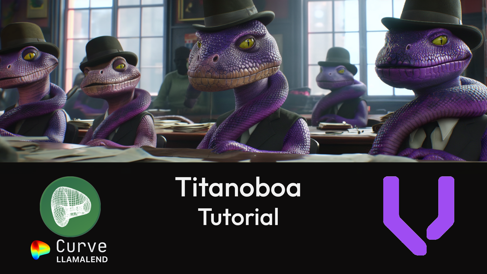

# Curve Llama Lend Titanoboa Tutorial

Companion repository for Curve's [YouTube Titanoboa Tutorial](https://www.youtube.com/playlist?list=PLVOHzVzbg7bFq3aKvq4sBMIIKApC-Fsh5) 

## About This Tutorial

This tutorial covers how to launch a memecoin and manage it on [Curve Llama Lend](https://www.youtube.com/watch?v=xZ5yPd7rIEg&list=PLVOHzVzbg7bFkpn3K1duCvRPKwREWP1SQ&pp=gAQBiAQB) using Vyper's Titanoboa.

To complete this course we recommend you have a basic understanding of Vyper, which you can obtain by completing the companion [Vyper Tutorial](https://github.com/curvefi/vyper-tutorial).
Each lesson will contain a downloadable Jupyter Notebook.  The contents of this repository will also be mirrored at [try.vyperlang.org](https://try.vyperlang.org/hub/user-redirect/lab/tree/shared/zcor/boa-tutorial)

## Main Series

* [Lesson 1: Launch](lesson-01-launch/)
* [Lesson 2: Fork](lesson-02-fork/)
* [Lesson 3: Magic](lesson-03-magic/)
* [Lesson 4: Blueprint](lesson-04-blueprint/)
* [Lesson 5: Soft Liquidation](lesson-05-soft-liquidation/)
* [Lesson 6: Self-Liquidation](lesson-06-self-liquidation/)
* [Lesson 7: Pure Liquidation](lesson-07-pure-liquidation/)
* [Lesson 8: Extended Liquidation](lesson-08-extended-liquidation/)
* [Lesson 9: Partial Liquidation](lesson-09-partial-liquidation/)

## Links

* [Curve Llama Lend](https://lend.curve.fi/)

**Documentation**
* [Boa Documentation](https://titanoboa.readthedocs.io/en/latest/overview.html)
* [Vyper Documentation](https://vyper.readthedocs.io/)
* [try.vyperlang.org Mirror](https://try.vyperlang.org/hub/user-redirect/lab/tree/shared/zcor/boa-tutorial)

**Social**
* [Vyper Discord](https://discord.gg/3NVVy6qZ3F)
* [Vyper Telegram](https://t.me/vyperlang)
* [Curve Discord](https://discord.gg/FBPv6scf7R)
* [Curve Telegram](https://t.me/curvefi)

**Tutorials**
* Ape Framework: [YouTube](https://www.youtube.com/playlist?list=PLVOHzVzbg7bFjWllFfBIxdkJ6-tZ9Wj_Y) | [GitHub](https://github.com/curvefi/crvusd-ape-tutorial)
* Brownie: [YouTube](https://www.youtube.com/playlist?list=PLVOHzVzbg7bFUaOGwN0NOgkTItUAVyBBQ) | [GitHub](https://github.com/curvefi/brownie-tutorial)
* Vyper: [YouTube](https://www.youtube.com/playlist?list=PLVOHzVzbg7bFnLnl3t5egG5oWpOhfdD1D) | [GitHub](https://github.com/curvefi/vyper-tutorial)
* Llama Lend: [YouTube](https://www.youtube.com/playlist?list=PLVOHzVzbg7bFkpn3K1duCvRPKwREWP1SQ)
